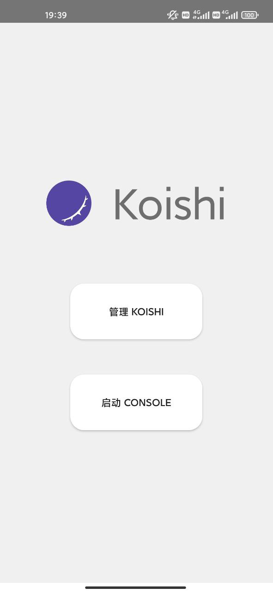
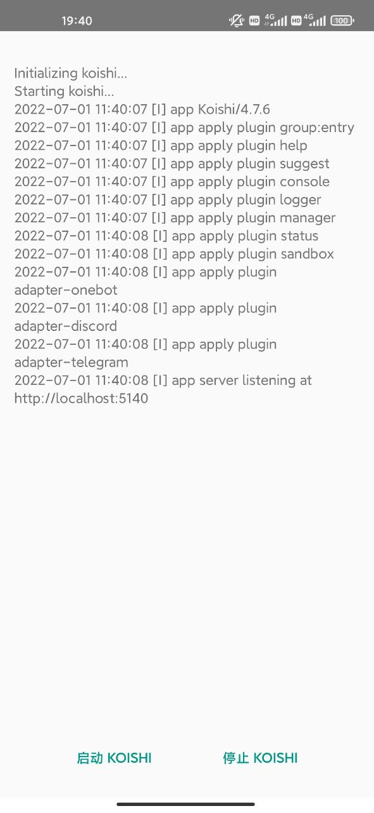

  
  <h1 id="koishi">
    <a href="https://koishi.chat/manual/starter/android.html" target="_blank">Koishi Android</a>
  </h1>

Koishi Android 实现了从您的手机上启动 Koishi。

Koishi 是一个现代化跨平台机器人框架。如果您还不了解 Koishi，可以在 [Koishi 的官方文档](https://koishi.chat/manual/introduction.html) 中了解 Koishi。

## 特性

Koishi Android 支持安装 APK 之后一键启动 Koishi，省去了在手机上搭建 Koishi 的繁琐步骤，并且得益于 Koishi 强大的控制台，您可以轻松地对您的 Koishi 进行管理。

Koishi Android 支持了在应用中运行 Headless Chromium，为 Koishi 的 puppeteer 插件提供了运行环境，为各种插件提供了图片渲染的环境。同时 Koishi 生态中也有丰富的插件。基于 puppeteer，可以轻松地做到图片的渲染，架设出更加优秀的机器人。

Koishi Android 内置了 [go-cqhttp](https://github.com/Mrs4s/go-cqhttp) ，可以轻松启动 go-cqhttp 而不需要额外搭建 go-cqhttp 服务器。同时 Koishi Android 内置了 sqlite 数据库，做到了让依赖数据库的插件开箱即用。

## 构建

若要构建 Koishi Android，需要在 `app/src/main/assets/bootstrap` 中放以下文件:

- `bootstrap.zip`、`env.txt` 进入 bootstrap 文件夹后执行 `nix run .#copy`
- `yarn.js` 使用 `curl -O https://repo.yarnpkg.com/3.2.0/packages/yarnpkg-cli/bin/yarn.js`
- `koishi.zip` 在 `https://github.com/koishijs/boilerplate/releases` 中下载 `arm64` 架构的文件并改名为 `koishi.zip`

## 原理

Koishi Android 使用了 [nix](https://nixos.org) 来构建需要的环境。

使用 [proot](http://github.com/termux/proot) 实现用户空间的模拟与隔离。

## 鸣谢

[Koishi](https://koishi.chat) 提供了优秀的 bot 框架与生态。

[nix-on-droid](https://github.com/t184256/nix-on-droid) 参考了 nix-on-droid 的实现，部分代码来自于 nix-on-droid，为 Koishi Android 提供了思路。

## 截图

  
  

## 贡献

欢迎给本项目提交 Pull Request。